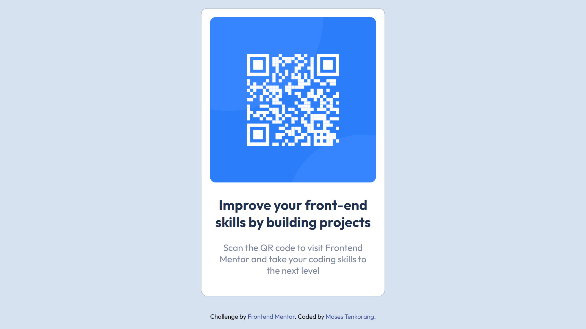

# Frontend Mentor - QR code component solution

This is a solution to the [QR code component challenge on Frontend Mentor](https://www.frontendmentor.io/challenges/qr-code-component-iux_sIO_H). Frontend Mentor challenges help you improve your coding skills by building realistic projects. 

## Table of contents

- [Overview](#overview)
  - [Screenshot](#screenshot)
  - [Links](#links)
- [My process](#my-process)
  - [Built with](#built-with)
  - [What I learned](#what-i-learned)
  - [Useful resources](#useful-resources)
- [Author](#author)


## Overview
A mobile responsive website for a QR Code image.

### Screenshot




### Links

- Solution URL: [Add solution URL here](https://your-solution-url.com)
- Live Site URL: [Add live site URL here](https://your-live-site-url.com)

## My Process

### Built with

- [Visual Studio Code](https://code.visualstudio.com/)
- [Live Sass Compiler](https://marketplace.visualstudio.com/items?itemName=glenn2223.live-sass)
- Semantic HTML5 markup
- CSS Grid
- Mobile-first workflow

### What I learned

```css
img {
  width: 100%;
}
body{
  display: grid;
  place-items: center;
}
```

### Useful resources

- [SASS](https://sass-lang.com/) - This helped me write a better structured CSS. I really like it and will use it going forward. Highly recommended. You can check YouTube for some helpful tutorial videos. 

## Author

- GitHub - [Moses Tenkorang](https://github.com/mtenkorang)
- Frontend Mentor - [@yourusername](https://www.frontendmentor.io/profile/yourusername)


HAPPY CODING!!!